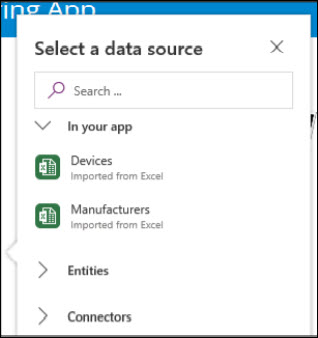
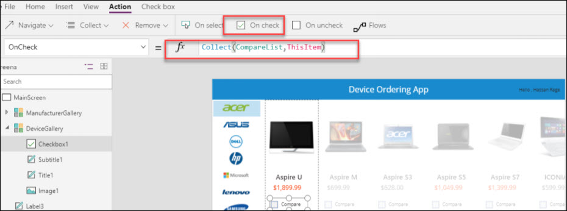
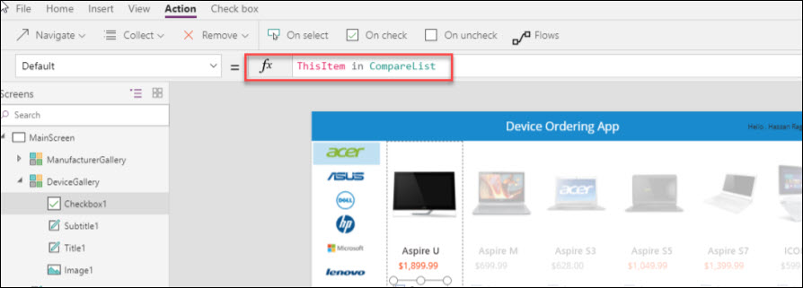
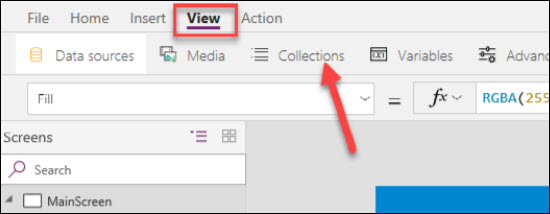
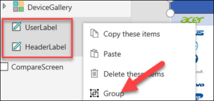
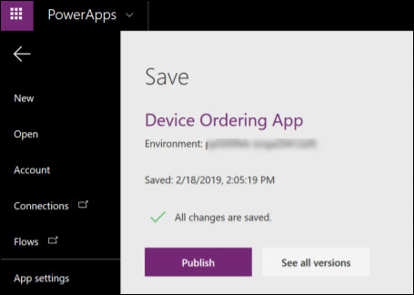

# Power Platform App in a Day
## Module 1: Power Apps Canvas App

### Contents
Power Apps Canvas App</br>
Lab Prerequisites</br>
Power Apps Canvas Studio Layout</br>
Goals for this lab</br>
Introduction: Device Ordering Scenario</br>
#### Solution overview
Locale-specific difference in formulas</br>
Exercise 1: Create the app in Power Apps</br>
Exercise 2: Add Device Gallery and Connect to Data Source</br>
Exercise 3: Add Compare</br>
Lab survey</br>
References</br>
Copyright</br>


### Power Apps Canvas App
#### Lab Prerequisites
Follow the pre-requisite steps described in the document: **00-AppInADay Lab Overview.pdf**, that is included in the lab package. Before beginning this lab, confirm that you have provisioned an environment where you will save your apps,flows and database entities.</br>

``IMPORTANT: Do not proceed before going through the lab pre-requisite steps``

#### Power Apps Canvas Studio Layout
**Power Apps Canvas Studio** is available as a web application (Make Power Apps) that you can use in any modern browser.
Power Apps Studio is designed to have a user interface familiar to users of the Office suite. It has three panes and a ribbon that make app creation feel **like building a slide deck in PowerPoint**. Formulas are entered within a function bar that is like Excel. Studio components:</br></br>
1. **Left navigation pane**, which shows all the screens, data sources, and controls in your app</br>
2. **Middle pane**, which contains the app screen you are working on</br>
3. **Right-hand pane**, where you configure properties for controls, bind to data, create rules, and set additional advanced settings</br>
4. **Property drop-down list**, where you select the property for the selected control that you want to configure</br>
5. **Formula bar**, where you add formulas (like in Excel) that define the behavior of a selected control</br>
6. **Ribbon**, where you perform common actions including customizing design elements</br>
7. **Additional items**, here you will find your environment selection, app checker, and the preview app functionality.</br>
   <br/>

### Goals for this lab
   <br/>

## Introduction: Device Ordering Scenario
Imagine an organization where every three years the employees go through a hardware refresh cycle. The organization would like to build a customized app that runs on the web and mobile devices, which will help streamline the device order and approval process. Moreover, they do not have traditional development resources available, such as a .NET, Xamarin or custom website developer, to create this application.

#### Solution overview
The Microsoft business application platform technologies enable tech-savvy business users (aka “citizen developers”) to build a customized device ordering solution. The application user interface and interaction logic are built in Power Apps, the approval workflow is automated using Power Automate, and the device order data is stored in the Common Data
Service.</br>

Key features of the solution:</br>
a. Ability to browse through a selection of devices and filter the list by manufacturer</br>
b. Select devices to compare</br>
c. View detailed specs for the selected devices on a second comparison screen</br>
d. Select a device to order</br>
e. Enter order details into a customized form, including an optional coupon image</br>
f. By default, have the approver set to the logged in user’s manager</br>
g. Capture additional default properties, such as the date of the request</br>
h. Store device orders in a secure and scalable database</br>
i. Enable an admin to view all device orders</br>
j. Follow a customized procurement process to place purchase orders for devices</br>
k. Send an automated approval request email when the order is placed</br>
l. Allow the approver to approve or reject an order and add comments without leaving their email inbox</br>
m. View all sent and received approval requests on the web and mobile</br>
n. Notify the user via email when their order is approved or rejected</br>

This document will walk through creating a Power Apps Canvas Studio basics to enable features (a) thru (d).</br>
When you are done with this first portion of the lab, your app will look like this:</br>
   <br/>

### Locale-specific difference in formulas
Before you begin, please note that if your computer has its regional settings set to use the comma ‘,’ for itsdecimal separator (like in much of Europe) your formulas will need to use a semicolon ‘;’ instead of a comma in your formulas. For example:</br>
En-US       Filter(Machines, OEMsGallery.Selected.MFR=MFR)</br>
de-DE       Filter(Machines; OEMsGallery.Selected.MFR=MFR)</br>

These localized formats are indicated with the <image> symbol throughout the document. If you are in the en-us locale, you can ignore any of the formulas indicated by the locale symbol.

### Exercise 1: Create the app in Power Apps

``IMPORTANT: Do not proceed before going through the lab pre-requisite steps``

#### Task 1: Sign-in to Power Apps web studio
1. Go to Power Apps and click Sign-in. You may also directly navigate to Make Power Apps.</br>
   <br/>
2. Sign in with your business or school account if you have not already done so.</br>
3. Before creating an app, let’s switch to the new environment that you created. Click the Environment dropdown in the top right of the screen to switch to the new environment. (If your environment doesn't show up, try logging out and logging in again)</br>
   <br/>

#### Task 2: Create a new application
1. Select **Home** from navigation and click **Canvas app from blank**.</br>
   <br/>
2. Input **Device Ordering App** in the App Name field. Select **Tablet** for Format. Click **Create**.</br>
   <br/>
3. Click **Skip** if you receive the **Welcome to Power Apps Studio** prompt.</br>
4. If prompted, select your region, then click **Get started**.</br>

#### Task 3: Rename the screen
In this task, you will rename Screen1 to MainScreen.</br>
1. Select the screen by clicking the **Screen1** tile in the **Tree view**.</br>
2. Click “…” next to **Screen1** (or right click Screen1) and select the **Rename** option.</br>
   <br/>
3. Change the name to **MainScreen**.</br>
   <br/>
``Note: You can also rename the screen by clicking on the screen name in the right pane and selecting the edit icon, or double clicking on it.``

``Tip: It is a good practice to rename screens and controls as you create them, so they are easier to locate as you work withformulas that reference different controls. In this lab, you will be prompted to rename screens and some of the controls. For the others, you may rename them as you please on your own. It is important that you rename screens as prompted in this lab as future steps may rely on specific screen names.``

#### Task 4: Add a header containing the app name and logged in user’s name
1. With MainScreen selected, click on the **+ Insert** button.</br>
   <br/>
2. Drag **Text Label** from the Insert pane and drop it on the MainScreen.</br>
   <br/>
3. Select the **Tree View** tab.</br>
   <br/>
4. Rename the label from Label1 to **HeaderLabel**, see the previous task on renaming controls.</br>
   <br/>
``NOTE: It is IMPORTANT to rename this label correctly, so subsequent instructions in the lab work as expected.``
5. Select **Text** from the property drop-down list and enter **“Device Ordering App”** in the formula bar. You can also type directly in the label.</br>
   <br/>
6. Resize the label such that the width is the width of the screen and the height is a reasonable size for a header. You can resize the label by either dragging the corners of the label or adjusting the size in the Right Pane.</br>
   <br/>
7. Center align the text.</br>
   <br/>
8. Select the **Home** tab, change the **Fill** to blue and the font **Color** to white.</br>
   <br/>
9. Select the **Home** tab and change the **Font Size** to 24.</br>
   <br/>
**Tip:** You can also use the formula bar above or the Advanced tab on the far right of the screen to enter specific values or formulas for any property on a control.</br>
10. Select **+ Insert** button and drag another **Text Label** to the MainScreen. You will use this label to display the logged in user’s name.</br>
   <br/>
11. Drag the label to the far-right side of the screen as shown and center the label vertically to be in line with the header text. As you center your label, purple alignment markers will appear.</br>
   <br/>
12. Rename the label to **UserLabel**.</br>
13. Change the value of the Text field to: "Hello, " & User().FullName</br>
   <br/>
``Note: All functions in Power Apps are case sensitive. As you start typing “User” you will see a drop-down of available choices. It is a good idea to pick from the autocomplete options. You will also notice help text at the top showing the required parameters, in this case, it requires no input parameters.``
14. Right-align the text in the label by selecting the **Align** and **Align Right** option in the **Home** tab on the ribbon.</br>
15. Change the text **Color** to **White**.</br>
16. Widen the label, so the text does not wrap for longer usernames.</br>
17. Change the **PaddingRight** property from **5** to **20**. You can do this quickly using the Properties pane on the right side.</br>
   <br/>
``Note: The User() function in Power Apps allows you to retrieve the Email, Full Name, and Picture for the currently logged in user. App users will always be logged in with their business or school account (Azure Active Directory (AAD) credentials),so this information will always be available for any Power Apps app.``

#### Task 5: Save the Application
In this task, you will save an initial version of the app. It is a good practice to keep saving app updates at regular intervals.</br>
1. First, you will check if there are any errors. Click on then **App Checker** icon.</br>
   <br/>
2. The **App Checker** pane will come to view. Errors will be displayed here if there are any.</br>
3. Close the **App Checker** pane.</br>
4. Click **File**.</br>
   <br/>
In the application settings page, you can:</br>
- Change your app name</br>
- Customize the app icon – choose a background color and icon</br>
   <br/>
5. Select the **Screen Size + Orientation** tab to view the available screen orientation and aspect ratio settings. For this app, we will leave it at the default setting of Landscape with 16:9 aspect ratio.</br>
   <br/>
6. Click **Save** in the left navigation.</br>
7. Select **The cloud** and click **Save**.</br>
  <br/>
8. After the app is saved, click the **Back** arrow in the top left to get back to the studio.</br>
  <br/>
**Tip:** In Power Apps when you save a version of your app the first version is published by default and available to everyone you share the app with. Subsequent saves are only visible to the app maker in the studio. You must explicitly publish it for all app users to get the update. For more details on saving, publishing and sharing apps, see:
Publish App<link></br>
Share App.<link></br>
Sane and Publish App<link></br>

### Exercise 2: Add Device Gallery and Connect to Data Source
In this exercise, you will add a gallery of all available devices making it easy for users to browse the list and get a quickoverview of the devices available.</br>
### Task 1: Add device gallery
1. With MainScreen selected, select the **Insert** tab.</br>
2. Click **Gallery** and select **Horizontal**.</br>
  <br/>
This will add a gallery called **Gallery1** onto the screen. Notice the control tree view on the left displays this gallery with three controls within it – two labels and an image. A data pane will pop up on the right.</br>
  <br/>
3. Expand Connectors, then click Show all connectors.</br>
  <br/>
4. Select **Import from Excel**.</br>
  <br/>
5. In the File Open dialog, browse to the location where you unzipped the data file (for example
C:\AIAD\PAHandsOnLabContent\) and select **Device-Order-Data.xlsx** to load it.</br>
  <br/>
6. Select both tables, **Devices** and **Manufacturers**, and click the **Connect** button. This will add both these tables as static data into the application.</br>
  <br/>
**Note:** In this lab, you will work with tables imported from a static data file and embedded as resources in the app. If you were building a real solution, the same tables would likely be stored in the cloud, such as in a SharePoint list, a SQL table, or a Common Data Service entity.</br>
7. Select **Gallery1** and notice the **Items** property is set to **Devices**. Notice the gallery is populated with data.</br>
  <br/>
8. Rename the **Gallery1** to **DeviceGallery**.</br>
  <br/>
**Tips on working with galleries:**<br/>
Galleries provide a powerful way to visualize tabular data in Power Apps. It is important to become familiar with customizing a gallery. Key components of a gallery: the gallery control, the template cell (first cell), and controls within the template cell.</br></br>
To select the **entire gallery** – click on the gallery in the tree view on the left or click on the second or third cell. Clicking any cell that is not the first cell of the gallery will select the entire gallery. Now you can specify properties that apply to the entire gallery, such as the Items property which is the data source, the gallery fill color, borders, etc.</br></br>
To customize how each item is displayed in the gallery, you will customize the template cell. Select the template byclicking in the first cell of the gallery or click on the pencil icon in the top left corner when the entire gallery is selected.</br></br>
You can now add, remove and customize the controls within the template cell. These changes will then repeat across each item or row in the table.</br></br>
Go ahead and select the device image in the template cell and **change its size**. Notice how the size of the image changes in all the cells.</br></br>
You can also test your gallery right on the canvas by holding down the Alt key to activate</br>
You will customize the device gallery in subsequent steps.</br></br>
Don’t worry about making the gallery pixel perfect, the purpose of this exercise is to get your app working with a good enough UX. You can always repeat these labs to practice your pixel perfect skills.</br>

### Task 2: Arrange the device gallery
1. Resize and reposition the gallery. You can drag and drop the gallery or use the gallery properties pane on the right.</br>
  <br/>
2. Select the **DeviceGallery** and click the **Edit (pencil) icon** in the top left to edit the template cell.</br>
  <br/>
3. Using the right drag control, resize the first box to be narrower. Notice that all the items get narrower and more devices are visible on the screen.</br>
  <br/>
4. Narrow the image as well by **clicking on the image control and resizing it using the drag handles**. Make sure the width of the image control is positioned within the template.</br>
  <br/>
5. Notice the gallery control on our screen automatically has scrolling capabilities.</br>
  <br/>
### Task 3: Add gallery to show manufacturers
In this task, you will add a second gallery that will list the various device manufacturers. This will be a single column vertical gallery down the left side of the screen, with each cell displaying the manufacturer’s logo image. This gallery will later be used as a filter for the device gallery created above.</br>
1. Select the **MainScreen**.</br>
2. Select the **Insert** tab on the ribbon and open the **Gallery** drop-down, then select **Vertical**.<br/>
  <br/>
3. Select **Manufacturers** for the data source.</br>
  <br/>
4. Rename the gallery to **ManufacturerGallery**.</br>
  <br/>
5. Move this new gallery so that it is left aligned with the left edge of the screen and top aligned with the top of the device gallery. Your two galleries should like the image below.</br>
  <br/>
6. Select **ManufacturerGallery** (not just the template cell), in the **Properties** tab on the right, click **Layout**.</br>
  <br/>
7. Scroll down to the **Gallery** section and select **2 Columns**.</br>
  <br/>
8. Change the **Wrap Count** from 2 to 1. This will change it to a single column gallery.</br>
  <br/>
9. Select the **image control** within the gallery (the Edit Pencil icon) and **reduce its height** by dragging the middle bottom drag control upwards. If you select the first image, the image size will reduce whereas the template size will still be expanded.</br>
10. Reduce the **height of the template cell** to match the image below. We essentially want the image to occupy the entire cell.</br>
  <br/>
11. Click **File** and **Save** the application.</br>
12. Click on the **Back** arrow.</br>

### Task 4: Connect ManufacturerGallery to manufacturers table
Earlier you connected the data source using the Data tab in the right pane. You can also connect to data via the formula bar.</br>
1. Select the **ManufacturerGallery**. Make sure the whole gallery is selected and not just the first cell.</br>
2. Select **Items** from the property drop-down next to the formula bar. Notice that the gallery is populated with images of buildings. This is because Power Apps picked a default binding which mappedto the HQ column in the table.</br>
  <br/>
3. Select the image control in the first template cell in the gallery and change the value of Image in the formula barfrom **ThisItem.HQ** to **ThisItem.Logo**. All the gallery items will now display logo images. You can also use the left tree view to select the controls, sometimes that is easier!</br>
  <br/>
``Note: Autosuggest offers you valid options for authoring formulas. See in the image below, we want to define the image to display from our data. Once we type ThisItem our Autosuggest tells us that we have three valid options forthis formula. This can help guide you to making valid formulas.``
  <br/>
4. Select the first (top-most) image and using the **Properties** pane on the right, set the **Image position** property to **Fit**.</br>
  <br/>
5. Reduce the height of the template cell such that all nine manufacturers fit without a scrollbar. To do this, use the drag handles to first reduce the height of the image and subsequently reduce the height of the template cell. Note again that to select the template cell, select the entire gallery and click on the pencil icon in the top left.</br>
  <br/>

### Task 5: Highlight the selected item in the gallery
In this task, you will use the **TemplateFill** property of the manufacturer gallery to specify a highlight color for the selected item</br>
1. With the **ManufacturerGallery** selected, set the **TemplateFill** property on the gallery to the following formula to conditionally set the fill color of the selected cell to light blue:</br>
```
If(ThisItem.IsSelected,LightBlue)</br>
Alternately, you could set the TemplateFill property to:</br>
If(ThisItem.IsSelected,ColorFade(HeaderLabel.Fill,75%))</br>
```
This approach is recommended so the fill color matches the header label with a 75% fade. If you change the fill color of header label, the fill color of the selected item in the gallery will automatically change.</br>
  <br/>
2. Now try using the preview mode to perform a quick test of this highlighting. You can enable preview mode by holding down the Alt key (also known as the Option key) and clicking a few different manufacturers in the gallery, notice the selected item in the manufacturer gallery is highlighted in a light blue color. The preview mode ends when you stop holding the key.</br>
Alternatively, you could click the Play ( ) button to enter preview mode, and to exit this you would hit the X in the upper right corner or use the Esc key.</br>

### Task 6: Filter the devices based on selected manufacturer
In this task, you will use the Filter() function to filter the items in the DeviceGallery to only display devices that match the selected item in the ManufacturerGallery.</br>
1. Select the **DeviceGallery**. With the Items property selected, enter the following expression in the formula bar:</br>
Filter(Devices, ManufacturerID = ManufacturerGallery.Selected.ManufacturerID)</br>
for alternate/European locales:</br>
Filter(Devices; ManufacturerID = ManufacturerGallery.Selected.ManufacturerID)</br></br>
This will filter the device gallery to only display items that match the selected manufacturer based on **ManufacturerID**.</br>
  <br/>
2. Select a different item in the manufacturer gallery on the left, and you will notice the device gallery will update accordingly. Note: In some cases, the first few items won’t show the selection, try selecting the 5th or 6th item if that occurs.</br>
  <br/>
``Note: If you get an error when entering the Filter command, check the name of the manufacturer gallery. The name inthe filter command must match the name of your gallery.``

More details on the Filter() function is available at Filter Lookup.</br>
A complete set of expressions is available at Formula Reference.</br>

### Task 7: Configure text labels in the device gallery
1. Select the subtitle in the **DeviceGallery**. It is named **Subtitle1** in the tree view. It may already have the default value set to the **DeviceType** property (e.g. Tablet).</br>
2. Let us now change the label to display the device price by setting the label’s Text property to: **ThisItem.Price**</br>
  <br/>
Here are some additional formatting suggestions. These are for cosmetic purposes only, feel free to skip past these:</br>
- Expand the width of the label to the template width.</br>
Notice that the second label expands as well. This is because it is X property is set to Title1.X, the X coordinateposition of the Title1 label. For more on the relative positioning of controls, see UX Patterns</br>
- Change the **PaddingLeft** from 0 to 10.</br>
- Change the font to **Segoe UI**.</br>
3. Select the **Title1**.</br>
4. In the property drop-down list, select the **Text** field and change to **ThisItem.Title**.</br>
  <br/>
5. To add the $ to the Subtitle, use the text format expression: Text(ThisItem.Price,"$##,###.00") or for alternate/European Text(Price;"$##.###,00")
locales:
```Note: After you enter the above value in the formula bar, it will automatically resolve to include your locale, e.g. [$-en-US]. If you see an error here, it might be because your locale is not yet supported, in which case as aworkaround, manually change it to [$-en-US]:```
  <br/>

#### Optional UI enhancement:
- Like above, expand the width of the label to the template width and change the value of the **PaddingLeft** property of the Title1 label from 0 to 10. Or set it to Title1.PaddingLeft.</br>
- Change font to **Segoe UI**.</br>

### Task 8: Conditional formation to highlight devices above $1,000
We can make it easy to spot devices that cost more than $1,000, by displaying the price in Red.</br>
1. Select the label in the template cell that displays the price and set the **Color** to</br>
If(Price>1000,OrangeRed,Gray) or for alternate/European locales: If(Price>1000;OrangeRed;Gray)</br>
  <br/>
``Note: As you are typing this formula notice that the autosuggest shows a choice of matching colors. Power Apps comes with a set of standard colors that you can easily reference in any property that accepts a color value. You can also set specific RGB values.``
For a full list of Color functions and colors, see Function Colors</br>
2. Click **File** and select **Save**.</br>
3. Click the back arrow.</br>
  <br/>

### Task 9: Add a checkbox to add a device to Compare list
We want to allow users to select multiple devices to compare before making a final selection on the next screen.
1. Select the **DeviceGallery**, click the Pencil edit icon in the top left of the gallery to select the template cell.</br>
  <br/>
2. Make sure that only the first item in the gallery is selected (not the entire gallery).</br>
  <br/>
3. Add a checkbox by clicking ``Insert -> Input -> Checkbox``.</br>
  <br/>
4. Move the inserted checkbox below the price.</br>
  <br/>
5. Change the checkbox text to **“Compare”**. You can do this by setting the **Text** property.</br>
  <br/>

### Task 10: Create a collection for the selected devices
When a user selects a device to compare, we will add it to a collection called CompareList. You can think of this as an inmemory collection of devices that have been selected for comparison.</br>
1. Select the **Checkbox** control and click on the **Action** tab in the ribbon, click **OnCheck** and set the value in the formula bar to: Collect(CompareList,ThisItem)</br>
  <br/>
2. Set the **OnUncheck** value to: Remove(CompareList,ThisItem)</br>
  <br/>
This is required to make sure the unchecked items are removed from the collection.</br>
3. Set the **Default** property of the checkbox to the formula: ThisItem in CompareList</br>
  <br/>
The **Default** setting of the checkbox is a Boolean true or false value that determines if the checkbox should be checked or not by default. Setting it to this formula will ensure that the checkbox is checked by default if the item has already been added to the collection since the result will be true, i.e. this item *is* in CompareList.</br>
4. Let’s test out adding items to a collection by running the app in Preview (F5) or by clicking the Preview button on the top right. Click on the checkboxes of three devices.</br>
  <br/>
5. Close the preview.</br>
6. Click the **View** tab and select **Collections**.</br>
  <br/>
7. You will see the **CompareList** collection and the three items you selected.</br>
  <br/>
Note that each item in the collection has all the information for each machine that we get from the **Machines** data source, not just the fields we display in the Devices Gallery.</br>
8. Click the back arrow on the top left to get back to the main view.</br>
  <br/>
9. Click **Preview** again.</br>
10. Uncheck all the checked items and click on close the preview.</br>
  <br/>
11. Click the **View** tab and select **Collections**.</br>
  <br/>
12. All items will be removed from the CompareList collection.</br>
13. Click on then back arrow.</br>
For more information on working with Collections in Power Apps, see:</br>
Create Update Collections and Clear Collections</br>

### Task 11: Set the default selection to the first manufacturer and test the app
To avoid getting a blank list of devices when the app starts, set the default selected item in the Manufacturer gallery to be the first item.</br>
1. Select the entire gallery (by clicking **ManufacturerGallery** in the tree view on the left) and set the **Default** property of the gallery in the formula bar to: First(Manufacturers) This will set it to the first item in the table.</br>
  <br/>
2. To preview the app, press the Preview button on the upper right of the top menu. Pressing the F5 key will also preview the application. **Note:** You can also test your app right on the canvas by holding down the Alt key to activate buttons and other controls, as well as double-clicking to type into controls.</br>
3. Your app should look like the image below.</br>
  <br/>
4. To exit preview mode, click the X in the top right corner.</br>
  <br/>
5. Save the application.</br>

## Exercise 3: Add Compare Screen
The second screen is where users compare the selected devices and then choose the one they wish to submit for approval.</br>
This screen will include:</br>
• A back button for navigation back to the main screen.</br>
• A list of selected devices for comparison (carried over from the main screen).</br>
• Additional details for each device.</br>
• Highlighting the selected device</br>
In a subsequent lab, you will create the database entities to store the device orders and add an edit form to this screen to enter additional information and submit the request.</br>

### Task 1: Add screen
1. From the ribbon click **Home** and **New Screen** and choose **Blank**.</br>
  <br/>
2. Rename the screen to **CompareScreen****.</br>
  <br/>
3. In the left tree view, select the **MainScreen**, click on the **Insert** tab on the ribbon and select **Button** to add a button to the screen.</br>
  <br/>
4. Place the button in the bottom right corner.</br>
  <br/>
5. Set the button’s **Text** property to: "Compare " & CountRows(CompareList) & " item(s)"</br>
  <br/>
6. Resize the button, so the text fits without wrapping.</br>
  <br/>
7. Select the button and set its **DisplayMode** property to **Disabled** if there are no items in CompareList:</br>
If(CountRows(CompareList) > 0, DisplayMode.Edit, DisplayMode.Disabled)</br>
  <br/>
8. Unselect all devices – notice the button is grayed.</br>
  <br/>
9. Select the **compare button** and **copy (Ctrl-C)** this button.</br>
10. **Paste (Ctrl-V)** the button on the same screen.</br>
11. Position it to the left of the compare button.</br>
  <br/>
12. Change the **Text** property to "Clear selection"</br>
13. Set the **OnSelect** property for this button to: Clear(CompareList) This will remove all the items in the CompareList collection.</br>
  <br/>
14. Select the **Compare** button, click on the **Action** tab and select **Navigate**.</br>
  <br/>
15. Select **CompareScreen** from the drop-down and **ScreenTransition.None** for transition type.</br>
  <br/>
16. Click **Preview**.</br>
17. Select a couple of devices and click the **Compare** button and verify that it takes you to the second screen.</br>
18. You should navigate to the new empty screen. Close the preview.</br>
  <br/>
19. Go to the **MainScreen** in the left navigation.</br>
20. Select both the **UserLabel** and **HeaderLabel**, right click and select Group.</br>
  <br/>
21. Rename the group **Header**.</br>
22. Click on the … button of the **Header** and select **Copy**.</br>
  <br/>
23. Right click on the **CompareScreen** by and select **Paste**.</br>
  <br/>
24. Select the **Header** group, click on the **Align** button locate in the **Home** tab, and Select **Align Top**.</br>
  <br/>
25. The **Header** in the **CompareScreen** should look like the image below.</br>
  <br/>
26. Copy **DeviceGallery** from the **MainScreen** and paste it in the **CompareScreen**.</br>
27. Move the gallery to the left edge of the screen. Align the top of the gallery to be just under the header banner. Use the right drag handle to reduce the width of the gallery and create space for a data entry form on the right of the screen. You will insert a Form control here and configure it in a subsequent lab.</br>
  <br/>
28. Rename this gallery to **CompareListGallery**.</br>
  <br/>
  
### Task 2: Configure the gallery
In this task, you will configure the gallery to show devices that were selected from the comparison gallery on the MainScreen.</br>
1. Select the new **CompareListGallery**.</br>
2. Select **Items** in the property drop-down list and change the data source in the formula bar to CompareList.</br>
  <br/>
3. The gallery will now show the selected items from the MainScreen.</br>
  <br/>

### Task 3: Remove and add controls to the gallery
In the **CompareScreen** we are selecting a given item to get approved, so we do not need a Compare checkbox.</br>
1. Select the **Compare checkbox** on the left most template cell and press the **Delete** key to delete the checkbox.</br>
2. Now let’s add a few labels to display additional attributes about the device. A good way to do this is to copy pastean existing label. Select the first label in the gallery that is displaying the device name. Copy it (Ctrl-C) and paste it(Ctrl-V). Rename these labels as you go for ease of use later.</br>
3. Move the new label so that it is just below the price. Set the **Text** property to: ThisItem.ManufacturerName.</br>
  <br/>
4. Use the ribbon to change the font weight from **Semibold** to **Normal** and change the **Size** property from 20 to 18.</br>
  <br/>
5. Copy and paste this label and move the new fourth label below the third label. Set its **Text** property to: ThisItem.Memory</br>
  <br/>
6. Repeat this and add text boxes to display the additional device properties – Processor, Storage, ScreenSize, etc. Feel free to customize the labels by changing their Size, Color, Fill and Font Weight properties.</br>

``Note: For this lab, to save time you may add one or two of these additional properties and skip adding all the additional device properties.``

### Task 4: Highlight the selected device
Like the behavior in the manufacturer gallery in the first screen, use the **TemplateFill** property to specify a highlight color for the selected item.</br>
1. Select the **CompareListGallery**.</br>
2. With the whole gallery selected, set the **TemplateFill** property to:</br>
If(ThisItem.IsSelected,ColorFade(HeaderLabel.Fill,75%))</br>
  <br/>
This is conditionally setting a Fill color if the cell is selected.</br>
You could have set a specific color or RGB value, but we recommend using the ColorFade function, so it matches the header label with a 75% fade. If you change the fill color of header label, this template fill color will automatically change.</br>
3. Holding down **Alt**, click a few different items in the gallery, notice the selected item is highlighted in a light blue color.</br>

### Task 5: Add an icon to navigate to the first screen
1. Select the **CompareScreen**.</br>
2. Go to **Insert**, then **Icons** and select the **Left** icon. Position it in the upper left corner of the screen.</br>
  <br/>
3. Select the arrow control, change the **Color** property to **White**. You can change this in the formula bar or through the **Properties** pane on the right.</br>
  <br/>
4. Move the arrow to the top-left corner.</br>
  <br/>
5. Set the **OnSelect action** for the icon to Back(). This will cause navigation back to the previous screen.</br>
  <br/>

#### Optional UI enhancement:
Add **padding around the icon** using the Properties pane. Set the padding values to 10 each for Top, Bottom, Left, and Right. This will make the icon look smaller but still have a larger hit target for the click action. This is a good pattern to use for most icons.</br>

### Task 6: Test the app
Let’s save the app by selecting **File -> Save**. It is a good idea to save your app regularly. **Note:** You can also test your app right on the canvas by holding down the Alt key to activate buttons and other controls, as well as double-clicking to type into controls.</br>
1. Go to the **MainScreen** and **Preview** the app by hitting the **Play** button in the top right.</br>
  <br/>
2. Uncheck if there are any checked devices.</br>
3. Select **Microsoft** on the left to show a filtered set of devices.</br>
4. Check the compare box on a few devices on the main screen from a few different manufacturers.</br>
5. Click the **Compare** button to navigate to the compare screen.</br>
6. Tap or click on different devices in the gallery and verify that the selection highlight works.</br>
7. Click the **Back** button and confirm you get back to the main screen.</br>
  <br/>
8. Click **Clear Selection**.</br>
  <br/>
9. The **CompareList** will clear, and the **Compare** button will become disabled.</br>
  <br/>
10. Close the preview.</br>

### Task 7: Test the app on a mobile device
Congratulations! You’ve created your Power Apps app. Now let’s publish and test it on a mobile device.</br>
1. **File -> Save** and click the **Publish** button.</br>
  <br/>
2. Click **Publish this version** on the confirmation prompt.</br>
  <br/>
This action will publish the latest saved version of the app.</br>
3. Go to your device’s app store application. Search for **“Power Apps”** and install the Power Apps application.</br>
Launch the app.</br>
  <br/>
4. When the app starts, it will prompt for your business or school account credentials. **Log in** with the same account that you used to create the Power Apps app. You should see the app you just created in the list of apps. **Run the app**.</br>

### Task 8: [Optional] Share the application with a colleague
You may optionally share the application with another user within the same organizational tenant as the user who created the app. So, if you had logged in as meganb@contoso.com, you may share the app with any other User, Security Group or Distribution Group within the @contoso.com tenant.</br>
1. To share the app, go to Make Power Apps. Log in if prompted for credentials.</br>
2. Select **Apps** in the left pane, look for your Device Ordering app in the app list, click the three dots (…) next to the app to bring up the context menu. Click the **Share** option.</br>
  <br/>
3. In the share screen, enter the name or email of the user you would like to share the app with. You may also share it with a user group.</br>
  <br/>
4. Select the user or group; this will add it to the **Shared with** list below. You may provide this user/group either **Can use** or **Can edit** permissions.</br>
  <br/>
5. If the **Send an email invitation** is checked, when you hit **Save**, the user or all users in the group will receive an email letting them know that the app has been shared with them, along with a link to open the app.
  <br/>

### Next steps
Now that you have learned the basics of creating an app, take a little time to think about what you would like to create next. What made you most excited about the device ordering app? What would you have done differently? Here’s anexample of some changes you can make to the UI:</br>
Features like shading, number of rows, and greying out items not selected can have a big impact on how your app looksand feels. To learn more, check out the links in the reference section and take the next step in building great apps.</br>
  <br/>

### Lab survey
We would appreciate your feedback on the Business Application Platform technologies and on this hands-on-lab, such as the quality of documentation and the usefulness of the learning experience.</br>
Please use the survey at App in a day survey to share your feedback.</br>
You may provide feedback for each module as you complete it or at the end once you’ve completed all the modules.</br>
Thank you!

### References
App in a Day introduces some of the key capabilities available in Power Apps. For a list of learning resources, see Power Apps Resources and Power Automate Resources.</br>

#### Power Apps
- Website | Blog | Documentation | Community | Suggest Ideas | Webinars</br>
- Product updates</br>
- Guided Learning | YouTube playlist</br>
- Licensing / Pricing</br>
- Support – known issues | view/report issues | create a support ticket</br>
#### Power Automate
- Website | Blog | Documentation | Community | Suggest Ideas | Webinars</br>
- Product updates</br>
- Guided Learning | YouTube Playlist</br>
- Licensing / Pricing</br>
- Support</br>
#### Common Data Service (CDS)
- Common Data Service documentation portal</br>
- Feature updates</br>
#### Microsoft Power Platform
- Power Platform</br>

### Copyright

By using this demo/lab, you agree to the following terms:</br>
The technology/functionality described in this demo/lab is provided by Microsoft Corporation for purposes of obtaining your feedback and to provide you with a learning experience. You may only use the demo/lab to evaluate such technology features and functionality and provide feedback to Microsoft. You may not use it for any other purpose. You may not modify, copy, distribute, transmit, display, perform, reproduce, publish, license, create derivative works from, transfer, or
sell this demo/lab or any portion thereof.</br>

COPYING OR REPRODUCTION OF THE DEMO/LAB (OR ANY PORTION OF IT) TO ANY OTHER SERVER OR
LOCATION FOR FURTHER REPRODUCTION OR REDISTRIBUTION IS EXPRESSLY PROHIBITED.</br>

THIS DEMO/LAB PROVIDES CERTAIN SOFTWARE TECHNOLOGY/PRODUCT FEATURES AND FUNCTIONALITY,
INCLUDING POTENTIAL NEW FEATURES AND CONCEPTS, IN A SIMULATED ENVIRONMENT WITHOUT
COMPLEX SET-UP OR INSTALLATION FOR THE PURPOSE DESCRIBED ABOVE. THE TECHNOLOGY/CONCEPTS
REPRESENTED IN THIS DEMO/LAB MAY NOT REPRESENT FULL FEATURE FUNCTIONALITY AND MAY NOT
WORK THE WAY A FINAL VERSION MAY WORK. WE ALSO MAY NOT RELEASE A FINAL VERSION OF SUCH
FEATURES OR CONCEPTS. YOUR EXPERIENCE WITH USING SUCH FEATURES AND FUNCTIONALITY IN A
PHYSICAL ENVIRONMENT MAY ALSO BE DIFFERENT.</br>

**FEEDBACK.** If you give feedback about the technology features, functionality and/or concepts described in this demo/lab to Microsoft, you give to Microsoft, without charge, the right to use, share and commercialize your feedback in any way and for any purpose. You also give to third parties, without charge, any patent rights needed for their products, technologies and services to use or interface with any specific parts of a Microsoft software or service that includes the
feedback. You will not give feedback that is subject to a license that requires Microsoft to license its software or documentation to third parties because we include your feedback in them. These rights survive this agreement.</br>

MICROSOFT CORPORATION HEREBY DISCLAIMS ALL WARRANTIES AND CONDITIONS WITH REGARD TO THE
DEMO/LAB, INCLUDING ALL WARRANTIES AND CONDITIONS OF MERCHANTABILITY, WHETHER EXPRESS,
IMPLIED OR STATUTORY, FITNESS FOR A PARTICULAR PURPOSE, TITLE AND NON-INFRINGEMENT.
MICROSOFT DOES NOT MAKE ANY ASSURANCES OR REPRESENTATIONS WITH REGARD TO THE ACCURACY
OF THE RESULTS, OUTPUT THAT DERIVES FROM USE OF DEMO/ LAB, OR SUITABILITY OF THE INFORMATION
CONTAINED IN THE DEMO/LAB FOR ANY PURPOSE.</br>

### DISCLAIMER
This demo/lab contains only a portion of new features and enhancements in Microsoft Power Apps. Some of the features might change in future releases of the product. In this demo/lab, you will learn about some, but not all, new features.
