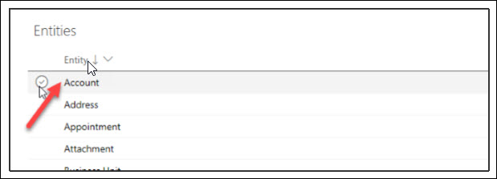
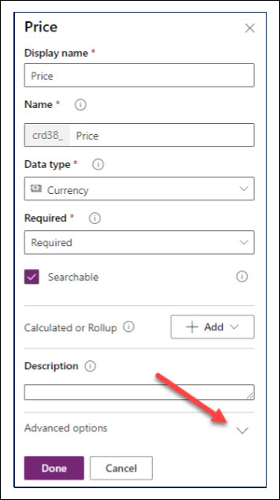
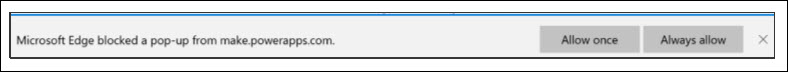
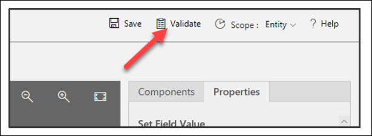
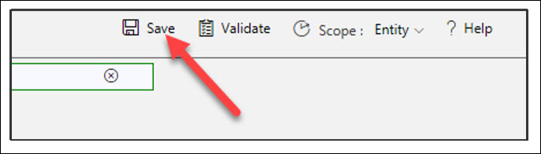
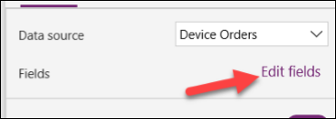

# Module 2: Common Data Service

## Contents
####  Common Data Service
Lab Prerequisites</br>
Before you begin</br>
Overview</br>
Goals for this lab</br>

#### Exercise 1: Exploring Common Data Service
Task 1: Explore standard entities</br>
Task 2: Explore standard option sets</br>

#### Exercise 2: Custom Entities and Fields 
Task 1: Create a custom entity</br>
Task 2: Create custom fields</br>
Task 3: Create a calculated field</br>
Task 4: Create a business rule</br>

#### Exercise 3: Connect the data from the Canvas App
Task 1: Add CDS entity as a data source to the app</br>
Task 2: Create the edit form</br>
Task 3: Configure the title field</br>
Task 4: Configure the price field</br>
Task 5: Configure the approval field</br>
Task 6: Configure the Comment field</br>
Task 7: Configure the Requested By field</br>
Task 8: Configure the requested date field</br>
Task 9: Add a button to submit the form</br>
Task 10: Test the form</br>
Task 11: Verify a new item was added to the Device Order entity</br>
Task 12: [Optional] Navigate to confirmation screen after the Form submit is successful</br>
Lab survey</br>
References</br>
Copyright

## Common Data Service
### Lab Prerequisites
This is the second lab in a series covering Power Apps Canvas Apps, Common Data Service, Power Apps Model-driven Apps, Power Automate, and Power BI. The assumption is that you have successfully completed the initial part of setting up an environment as described in the overview document – “00-AppInADay Lab Overview.pdf”.</br>

If you have not completed building the Power Apps Canvas App in Module 1, you can use the partially completed version of the lab package in the “\Completed\Module1” folder. Follow the instructions in the document “Importing Module 1 Completed” before proceeding with this module.</br>

### Before you begin
You must be connected to the internet.</br>
1. **Have a Test Environment with permission to create Common Data Service database**: You should have gone through the steps to create a new environment using the Admin center. In this lab, you will create a database in this environment if you haven’t already created one.</br>
2. **Sign-in to Power Apps**: Go to Power Apps and **sign in** with the same account you used to complete the first lab. Make sure you switch to the environment where you created the app.</br>

### Overview
The Common Data Service (CDS) adds data storage and modeling capabilities to Power Apps that is scalable and easy to provision. In this module, you will be using Common Data Service to model and store the data from the device ordering canvas app that you built in module 1. In the next module, you will be building a model-driven application using the same data that will be used by the back-office staff to process the device orders. These apps that you build on CDS use the same technology framework (Common Data Service) that Microsoft Dynamics 365 apps are built-on.</br>
   <br/>

### Goals for this lab
   <br/>

## Exercise 1: Exploring Common Data Service
In this exercise, you will explore Common Data Service standard entities. Entities in CDS are like tables in a database or worksheets in Microsoft Excel. Entities can be connected together with relationships that model real world interactions between the entities. Each entity contains multiple records (rows), each having data fields. For example, a “Project” entity may have fields such as Name, Due Date, Status, etc. and it may be related to a “Project Owner” entity which might have
fields such as Name, Email, etc.</br>

CDS abstracts a lot of the typical low-level database management work to make it easier for you to configure a custom data model that fits your application.</br>

In addition to allowing for the creation of custom entities, CDS contains a Common Data Model (CDM) consisting of hundreds of standard entity definitions. You can find the current CDM schema at Github Microsoft CDM and you can browse the CDM using the CDM Visual Entity Navigator located here Github CDM. You can read more about the CDM here Common Data Model Overview.</br>

### Task 1: Explore standard entities
In this task, you will explore Common Data Service standard entities.</br>
Before beginning the exercises, Navigate to Make Power Apps and confirm that you are in the desired environment for the labs.</br>
   <br/>
1. In the left pane, expand **Data** and select **Entities**.</br>
   <br/>
2. This will bring up the list of entities in this database instance. Click on a few of the standard entities (for example, **Account**) to get familiar with some of the features of an entity.</br>
   <br/>
For detailed documentation on CDS entities, see https://docs.microsoft.com/en-us/powerapps/developer/common-dataservice/reference/about-entity-reference

#### Fields:
An entity has a list of fields. In the example below, the “Account” entity has fields such as Account Name, Account Number, etc. Each field has a data type, such as Text, Number, etc. The data type is chosen when you create a field and is not changeable. The data type also defines many of the characteristics and behaviors of the field when your application runs. For example, an Option Set allows you to have a pre-defined list of values for use in your application. When this field
is used on a form in a model-driven application the visual presentation is a drop-down control. The field helps to ensure data consistency and allows for built-in support for multi-language applications.</br>
To see all the fields for the entity, change the default view in the top right corner to show all, or once you reach the bottom of the list you can click Remove Filter.</br>
   <br/>
For a list of supported data types, see Common Data Service Supported Data Types</br>

#### Relationships:
Relationships allows you to manage relationships between entities. Relationships supported are One to Many (1:N), Many to One (N:1) and Many to Many (N:N). Relationships also define the behavior that happens when actions occur on the primary record in a 1:N relationship. For example, if the parent record is deleted you can configure the relationship behavior so that all child records are also deleted or simply remove the reference.</br>

```Note: You will need to click the Relationships tab to see relationships. If you don’t see any relationships, click the Reset the Filter button.```
   <br/>

#### Business rules:
Building a Business rule is like building a flowchart where you can define conditions and actions. You can learn more about Business rules in the link below.</br>
Business Rules Recommendations: Business Rules Recommendations</br>
   <br/>

#### Views:
Views will let you define how a list of records are shown in the app. You can create multiple custom views, each having their own filtering and sorting criteria. For example, you could create a view to see only the records created in the last week and another one to see records that haven’t been updated in a year. Create views to make the application users more productive in filtering their data.</br>
   <br/>

#### Forms:
Forms provide the user interface that people use to interact with the data they need to do their work. It's important that the forms people use are designed to allow them to find or enter the information they need efficiently. You can create different types of forms like Quick Create, Quick View, Card, and a Main form. For some of these forms you can have more than one version, to accommodate for different user roles within your organization.</br>
   <br/>

#### Dashboards:
Dashboards helps you bring your views, charts, and web resources together in one place.</br>
   <br/>

#### Charts:
Use Charts to display high-level view of your data in insightful and graphical ways.</br>
   <br/>

#### Keys:
Allows you to view the lookup keys for the entity. Keys can contain multiple fields to define a composite key. Keys enforce uniqueness, so they should not be used when there is a need to store duplicate values of fields used.</br>
   <br/>

#### Data:
You can view and search the data in the entity table. This gives you a quick way to see some of the data for the entity without having to jump into a specific Canvas or Model-driven app.</br>
   <br/>
   
### Task 2: Explore standard option sets
Just like standard entities, the Common Data Service includes a set of standard **Option Sets**. You can also create custom **Option Sets**. Later in this lab, we will create a custom **Option Set** called **ApprovalStatus** to set the approval status of a device order.</br>
1. Select **Option Sets** from underneath the expanded **Data**.</br>
   <br/>
2. Examine the standard **Option Sets**.</br>
   <br/>

## Exercise 2: Custom Entities and Fields
In this exercise, you will create a new custom entity named Device Order and add fields necessary to track the device requests. You will also create a server-side Business Rule that will default the estimated ship date.</br>

### Task 1: Create a custom entity
In this task, you will create a custom entity to store device order requests.</br>
1. Select **Entities** in the left pane and click **New Entity** in the upper left corner of the page.</br>
   <br/>
2. Enter **Device Order**** for Display Name. The fields for Name and Plural name display name will automatically populate based on your entry. These are editable in case you need to make any changes. The plural name is used  by the system by default anytime a set of the records are shown. Check the Enable attachments since this will allow creating notes on the device order.</br>
3. Change the **Primary Field Display Name** to **Device Name**. The primary attribute defaults to being named Name, for some scenarios that might not be the best label and you can customize it if needed. The primary attribute however is always a Text field, that is not changeable.</br>
4. Click **Create**.</br>
   <br/>
5. If prompted, approve the option in this dialog.</br>
   <br/>

### Task 2: Create custom fields
In this task, you will create custom fields for the Device Order entity. It may take a few minutes for your new Device Order entity to provision. Begin these steps once it has finished.</br>
1. Select the **Fields** tab and click on the **Add field**** button to add fields to your custom entity.</br>
   <br/>
2. Enter **Price** for **Display Name**, select **Currency** for **Data Type**, make the field **Required** and **Searchable** and click **Advanced Options**.</br>
**Note**: Currency is a special data type. For each currency field you add, another currency field is added with the prefix “_Base” on the name. This field stores the calculation of the value of the currency field you added and the base currency. For additional information on using the Currency field, see here.</br>
   <br/>
3. Enter **Device Price** for Description, **0** for **Minimum Value**, **5000** for **Maximum Value**, and click **Done**.</br>
   <br/>
4. Click Add Field again.</br>
5. Enter **Requested By** for **Display Name**, **RequestedBy** for **Name**, **Email** for **Data Type**, make the field **Searchable** and click **Done**.</br>
   <br/>
6. Now repeat the Add field process and add the following fields</br>
   <br/>
7. Now we are going to create the **Approval Option Set**. We are adding this as an Option Set (as opposed to a two option) because it is likely in the future there will be more than two options for users to choose from. Click **Add Field**.</br>
   <br/>
8. Enter **Approval Status** for **Display Name**, **ApprovalStatus**** for **Name**, select **Option Set** for **Data Type**, and select **New Option Set** for **Option Set**.</br>
9. Change the **New Option** label to **Approve**</br>
10. Click **Add new item**.</br>
   <br/>
11. Enter **Reject** and click **Save**.</br>
   <br/>
12. Click **Done**.</br>
   <br/>
13. Click **Save Entity**.</br>
   <br/>

### Task 3: Create a calculated field
In this task, you will add a Department Contribution field and set its value to 10% of the price. In our scenario, this is the amount that will come from the department manager’s budget. Calculated fields are special fields that automatically perform the calculation when the data is retrieved. When you create or modify a calculated field you set the formula used in the calculation.
1. In the upper left corner of the screen, click on **Add Field** to add fields to your custom entity.</br>
2. Enter **Department Contribution** for **Display Name**, **Currency** for **Data Type**, click **Add Calculated or Rollup**, and select **Calculation**.</br>
   <br/>
3. Click **Save**.</br>
   <br/>
4. If you have not yet allowed popups from Power Apps, you will be prompted to do so now.</br>
   <br/>
5. Click **Add Action**.</br>
   <br/>
6. Type price and select the **Price** field you created.</br>
   <br/>
7. Add * 0.1 and click the **Check Mark** button.</br>
   <br/>
8. Click **Save** and **Close**.</br>
   <br/>
9. Click **Done**.</br>
**Note on currency fields:** You might notice that there are two Department Contribution fields one with (base) next to it. Currency fields in CDS store the base currency value (this is the configured default currency for the environment) and the transaction currency (this can be selected on a record by record basis) to allow support for multi-currency transactions. Generally, you will want to make sure to pick the field without the (base) in the name. The (base) value is commonly used in reporting where you want to normalize multiple currencies to allow reporting on them in the base currency value.</br>
   <br/>

### Task 4: Create a business rule
In this task, you will create a **Business rule** that will set the Estimated Delivery Date to 14 days after approval of the order.</br>
1. Select the **Business rules** tab and click **Add business rule**.</br>
   <br/>
2. Click the arrow to **Show Details**.</br>
   <br/>
3. Change the **Name** to **Calculate Ship Date** and click the arrow to **Hide Details**.</br>
   <br/>
4. Select the **Condition**, change the name to **Check Ship Date**.</br>
   <br/>
5. In the **Rule 1** section select **Entity** for **Source, Approved Date** for **Field, Contains Data** for **Operator** and click Apply.</br>
**Note:** You may need to scroll down to the bottom of all scroll bars to see the Apply button. You must click Apply after any change to the properties otherwise they will revert to the prior value. The Business Rule (Text View) will automatically update after you hit apply when you are done modifying the rule.</br>
   <br/>
6. Click **Add**, select **Add Set Field Value**.</br>
   <br/>
7. Select the True side of the condition.</br>
   <br/>
8. Enter **Set Estimated Ship Date** for **Display Name**, select **Estimated Ship Date** for **Field**, **Formula** for **Type, Approved Date** for **Field**, + for **Operator, Value** for Type, 14 for Days, and click **Apply**.</br>
   <br/>
9. Click **Validate**.</br>
   <br/>
10. Make sure validation succeeds.</br>
   <br/>
11. Click **Save**.</br>
   <br/>
12. Click **Activate**.</br>
   <br/>
13. Confirm activation. Business rules only execute when they are activated. In the future to make changes to rulesyou deactivate them, make the change, and then re-activate the rule.</br>
   <br/>
14. Close the process editor browser window or tab.</br>
15. Click **Done**. The list should refresh showing the Business Rule you just created.</br>
   <br/>
16. Your Device Order entity will have one Business Rule.</br>
   <br/>

## Exercise 3: Connect the data from the Canvas App
Now that you have created the entity to store device order requests let’s connect your Device Ordering Canvas app to this entity and add a form to submit device approval requests.</br>
### Task 1: Add CDS entity as a data source to the app
Open the device ordering app. Make sure you are opening the version of the app that is in the newly created environment that has the CDS database instance.</br>
1. Select Apps, select the Device Order App you created in Module 1, and click Edit.</br>
   <br/>
2. Select the Data sources to display the current sources. Expand entities.</br>
   <br/>
3. Click on Device Orders from the entity list to include it as a data source for our app.</br>
   <br/>

### Task 2: Create the edit form
1. Switch to the Tree view and select the MainScreen.</br>
   <br/>
2. Select few devices. Hold the “Alt” key, and then it will allow you to check the compare on the devices.</br>
   <br/>
3. Select the **CompareScreen**. You will now have the selected devices.</br>
   <br/>
4. Select the **Insert** tab, click **Forms**, and select **Edit**.</br>
   <br/>
5. Click the **Data Source** drop-down in the Data pane on the right.</br>
   <br/>
6. Select the **Device Orders** entity as the data source.</br>
7. Click **Edit Fields**.</br>
8. Add, remove, and order fields like the list below. The fields are added using the plus sign and can be reordered by dragging the field to the desired placement.</br>
a. Device Name</br>
b. Price</br>
c. Approver</br>
d. Comments</br>
e. Requested By</br>
f. Request Date</br>
9. Close the **Fields** pane.</br>
10. Move the form control **Form1** to the right of the screen and resize it using the drag handles such that it fits in the empty space. See picture on the right. Make sure there is enough space below the form to add a Submit button.</br>
**Note:** You can always select controls, such as the Form1 control, from the tree view on the left to make sure you are selecting the correct control. To move it make sure you select the Form and not a control within the form.</br>
11. Change the **Snap to columns** setting from 3 to 1. This will modify the layout of the edit form to be single column.</br>
For more info on working with multi-column form layouts, see Working with forms layout.
12. To create a new instance of the form when the screen is loaded. Click **CompareScreen** in left tree view pane.</br>
13. Select the **OnVisible** property of the screen, enter: **NewForm(Form1)**</br>

### Task 3: Configure the title field
In the next few steps, you will configure each of the form fields.</br>
Let’s start by configuring the Title to display the manufacturer and device name for the selected device. For example, if theuser selects the Surface Pro device, we want the device order to have the title: “Microsoft – Surface Pro”.</br>
1. Expand the **Device Name**.</br>
Notice that the default card contains a few controls:</br>
**StarVisible1:** This is a label control that has an asterisk (*) which has its Visible property set to true or false depending on whether the field is Required or not. Since the Title field was marked as Required when you configured the entity, its Required property is set to true.</br>
**ErrorMessage1:** This is a label that is just below the main data entry field which displays error messages.</br>
**DataCardValue1:** This is the text input control where you can enter the Title. For this scenario, we will set the title based on the selected device.</br>
**DataCardKey1:** This is the label that displays the title of the field.</br>
2. Select **Device Name DataCardValue** in the tree view. Then, open the **Advanced** tab in the right hand pane.</br>
3. Click **Unlock** so you can customize the card For the next few steps, we will use the Advanced pane to customize control properties within the form, note that you can perform the same customizations using the property drop-down and formula bar in the top left of the studio.</br>
4. Click **More Options** button in the **Data** section of the Advanced pane.</br>
5. To display the selected item in the Title field, set the **Default** property to CompareListGallery.Selected.ManufacturerName & " - " & CompareListGallery.Selected.Title</br>
6. Click **More Options** button in the **DESIGN** section of the Advanced pane. We are going to change the Device Name field to be read only so they don’t change it.</br>
7. Change the **DisplayMode** to **DisplayMode.View**. This will prevent users from changing the value within the text box.</br>

### Task 4: Configure the price field
In this task, we are going to set the price to the price of the item and then make it read-only.</br>
1. Expand **Price**.</br>
2. Select the **Data Card Value**.</br>
3. Select the **Advanced** tab and click **Unlock**.</br>
4. Change the **Default** property in the Data section to: CompareListGallery.Selected.Price</br>
5. Select the Price field and change the **DisplayMode** property to DisplayMode.View.</br>

### Task 5: Configure the approval field
Let’s set the default value for the Approver to be the email address of the **logged in user’s manager**.</br>
You will use the **Office 365 graph** to retrieve the manager’s email. You can find more about the Office 365 Users Connection provider here Office 365 Users Connection Provider</br>
1. Select **Data sources**. Expand Connectors. Select Office 365 Users.</br>
2. When prompted, click **Connect**</br>
3. Select the **Approver Data Card** from the Tree view.</br>
4. Go to the **Advanced** pane and **Unlock**.</br>
5. Set the Default value to: User().Email This expression will use your user’s email, so you won’t accidentally email your manager to approve your testing.</br></br>
In a real application or if you wanted to try the expression to use your managers email would be
Office365Users.Manager(User().Email).Mail This would make an API call at runtime to get the manager’s
email address of the logged-on user. If you try this and hit an error when calling the Office365Users.Manager() function, this may be because a manager is not set up in the system for the logged in Office 365 user. In that case, you can simply go back go User().Email.</br>
6. Save your work and return to the continue editing the app.</br>
The Office 365 User connector has access to many other valuable types of information you can learn more about the other actions and data available here Office 365 users Connector</br>

### Task 6: Configure the Comment field
1. Expand the **Comments** field and select the **DataCardValue**.</br>
2. Select the **Properties** tab and change the **Size -> Height** value to **80.**</br>
Optionally, you may select the Text Input control **DataCardValue** and set its **HintText** property to: “Enter justification” (without quotes).</br>

### Task 7: Configure the Requested By field
Let’s set the Requested By field to be the current logged on user’s email and disable the control so the user cannot change this value.</br>
1. Expand the **Requested By** card.</br>
2. Select the **DataCardValue**.</br>
3. Go to the **Advanced** pane and **Unlock** the card.</br>
4. Change the **DisplayMode** property to: DisplayMode.View</br>
5. Set the **Default** value to User().Email</br>
This is the email of the currently logged in user</br>

### Task 8: Configure the requested date field
Let’s set the Request Date to be today’s date.</br>
1. Expand the **Request Date** card.</br>
2. Select the **DateValue** card.</br>
3. Go to the **Advanced** pane and **Unlock** the card.</br>
4. Change the **DefaultDate** property to Today()</br>
Notice that the date in the calendar control will change to today’s date.</br>
Now we will hide the **Request Date** card. We don’t need to show this field to the user. Since we have included it as part of the form the field will get updated as part of the form submit.</br>
5. Select the **Request Date** DataCard</br>
6. Go to the **Properties** pane.</br>
7. Set the **Visible** toggle to **Off**.</br>

### Task 9: Add a button to submit the form
1. Select the **MainScreen**.</br>
2. Copy (Ctrl-C) the **Compare button** from the first screen which has the correct color values.</br>
3. Go back to the **CompareScreen** and paste (Ctrl-V) the button.</br>
4. Position it in the bottom right of the screen, center aligned with the Form.</br>
5. Make the button larger – you can resize to 280x60 using the Properties pane on the right.</br>
6. Set the button’s Text property to “Submit device request”</br>
7. Rename the button to **SubmitButton**.</br>
8. The button should be enabled only if a device is selected. To do this, change the button’s **DisplayMode** property to: If(!IsBlank(CompareListGallery.Selected), DisplayMode.Edit, DisplayMode.Disabled)</br>
**Note:** You might notice the exclamation mark (!) in the formula !IsBlank() Normally if you just have IsBlank() the check is for blank. Adding the exclamation mark (!) in front of it changes it to check if it is NOT blank.</br>
9. Next, we are going to configure what we want to happen when the button is clicked. Set the **OnSelect** property to SubmitForm(Form1).</br>
When the button is pressed, the form data will be submitted to the Common Data Service.</br>
10. Save your work and return to continue editing the app.</br>

### Task 10: Test the form
1. Select the **MainScreen** in the left side tree navigation and click Play.</br>
2. Select a few devices to compare. And click **Compare**.</br>
3. Select one of the devices.</br>
Notice that the Title, Price, Approver, and Requested By fields are already filled in.</br>
4. Change the Approver email to your own email for test purposes.</br>
5. Add some **Comments**, such as: “Current laptop does not work, need a new device.”</br>
6. Click **Submit device request**.</br>
The button should turn disabled (gray) for a few seconds while it’s submitting the request. If it does not do this there is likely an error. Click the X in top right to get back to the design mode.</br>
If there is an error, you will see a yellow error icon next to the Submit button, hover over it to check the error.</br>
7. The form will become empty after the record gets created, we will fix this issue in optional task. Exit the preview mode (‘X’ in top right).</br>
8. Save the Application and Publish</br>

### Task 11: Verify a new item was added to the Device Order entity
1. Open a browser window, go to Make Power Apps.</br>
2. Click on **Data -> Entities**.</br>
3. Select the **Device Order** entity.</br>
4. Select the **Data** tab.</br>
5. You should see a newly added row with your device order details. This may take a few seconds to load.</br>

### Task 12: [Optional] Navigate to confirmation screen after the Form submit is successful
This step is optional, if you’re short on time you may skip it and continue to the next module.</br></br>
Once the Form has been successfully submitted, it’s a good idea to show a confirmation screen and allow the user to navigate back to the main screen.</br>
1. Navigate to the Canvas Studio for your powerapp.</br>
2. Select **Home -> New screen -> Blank**</br>
3. Rename the screen to **SubmitSuccessScreen**</br>
4. Expand the **CompareScreen**.</br>
5. Select the Form – you can use the tree view on the left to select **Form1**.</br>
6. Set the **OnSuccess** property to: **Navigate(SubmitSuccessScreen,ScreenTransition.None)**</br>
7. Copy (Ctrl-C) the **Header** from the CompareScreen.</br>
8. Go to the to the **SubmitSuccessScreen**, paste the header and align Top.</br>
9. **Insert** another **label** in the middle of the screen and set the **Text** to: **"Your device request has been successfully submitted. Thank you**."</br>
10. Increase the font size, the size of the label and center the text.</br>
11. Add a **button** and set its **Text** to: **"OK”**.</br>
12. When the button is pressed, let us remove all the items from the CompareList collection and navigate to the first screen.</br>
13. Set the **OnSelect** property of the button to:</br></br>
Clear(CompareList);Navigate(MainScreen,ScreenTransition.None)</br>
**Note:** ‘;’ is used a separator when multiple functions are called one after the other. If you are in a locale where ‘;’ is used as a comma-separator, then use a double ‘;’ here (without the single-quotes).</br>
14. Move the label up and add a Display Form: **Insert -> Form -> Display**.</br>
15. Configure its **data source** to point to the **‘Device Order’** entity.</br>
16. Select the fields to display: Device Name, Price, Comments, Approver, Requested By, Request Date. Rearrange and remove any additional fields.</br>
17. Change the **Snap to columns** value from 3 to 1.</br>
18. Change the **Layout** from Vertical to Horizontal.</br>
19. Set form **Item** property to Form1.LastSubmit</br>
20. Reposition/Resize the form until it looks like the image below.</br>
21. Save your Changes and Publish.</br>
22. Select the **MainScreen** and click **Play**.</br>
23. Select few more devices and click Compare</br>
24. Select one of the new devices, provide a comment and click Submit.</br>
25. Verify that the confirmation screen shows the order details. Click OK.</br>
26. The application will navigate back to the main screen and the compare list will be cleared.</br>
27. Close the application.</br>

### Lab survey
We would appreciate your feedback on the Power Platform technologies and on this hands-on-lab, such as the quality of documentation and the usefulness of the learning experience.</br></br>
Please use the survey at App in a day lab survey to share your feedback.</br></br>
You may provide feedback for each module as you complete it or at the end once you’ve completed all the modules. Thank you!</br></br>

### References
App in a Day introduces some of the key functionalities available in Power Apps, Power Automate, Power BI and the Common Data Service. For an up to date list of learning references, see Power Apps Resources and Power Automate Resources and Power BI.</br></br>

### Copyright
By using this demo/lab, you agree to the following terms:</br></br>
The technology/functionality described in this demo/lab is provided by Microsoft Corporation for purposes of obtaining your feedback and to provide you with a learning experience. You may only use the demo/lab to evaluate such technology features and functionality and provide feedback to Microsoft. You may not use it for any other purpose. You may not modify, copy, distribute, transmit, display, perform, reproduce, publish, license, create derivative works from, transfer, or sell this demo/lab or any portion thereof.</br></br>
COPYING OR REPRODUCTION OF THE DEMO/LAB (OR ANY PORTION OF IT) TO ANY OTHER SERVER OR
LOCATION FOR FURTHER REPRODUCTION OR REDISTRIBUTION IS EXPRESSLY PROHIBITED.</br></br>
THIS DEMO/LAB PROVIDES CERTAIN SOFTWARE TECHNOLOGY/PRODUCT FEATURES AND FUNCTIONALITY,
INCLUDING POTENTIAL NEW FEATURES AND CONCEPTS, IN A SIMULATED ENVIRONMENT WITHOUT
COMPLEX SET-UP OR INSTALLATION FOR THE PURPOSE DESCRIBED ABOVE. THE TECHNOLOGY/CONCEPTS
REPRESENTED IN THIS DEMO/LAB MAY NOT REPRESENT FULL FEATURE FUNCTIONALITY AND MAY NOT
WORK THE WAY A FINAL VERSION MAY WORK. WE ALSO MAY NOT RELEASE A FINAL VERSION OF SUCH
FEATURES OR CONCEPTS. YOUR EXPERIENCE WITH USING SUCH FEATURES AND FUNCTIONALITY IN A
PHYSICAL ENVIRONMENT MAY ALSO BE DIFFERENT.</br></br>

**FEEDBACK.** If you give feedback about the technology features, functionality and/or concepts described in this demo/lab to Microsoft, you give to Microsoft, without charge, the right to use, share and commercialize your feedback in any way and for any purpose. You also give to third parties, without charge, any patent rights needed for their products, technologies and services to use or interface with any specific parts of a Microsoft software or service that includes the
feedback. You will not give feedback that is subject to a license that requires Microsoft to license its software or documentation to third parties because we include your feedback in them. These rights survive this agreement.</br></br>
MICROSOFT CORPORATION HEREBY DISCLAIMS ALL WARRANTIES AND CONDITIONS WITH REGARD TO THE
DEMO/LAB, INCLUDING ALL WARRANTIES AND CONDITIONS OF MERCHANTABILITY, WHETHER EXPRESS,
IMPLIED OR STATUTORY, FITNESS FOR A PARTICULAR PURPOSE, TITLE AND NON-INFRINGEMENT.
MICROSOFT DOES NOT MAKE ANY ASSURANCES OR REPRESENTATIONS WITH REGARD TO THE ACCURACY
OF THE RESULTS, OUTPUT THAT DERIVES FROM USE OF DEMO/ LAB, OR SUITABILITY OF THE INFORMATION
CONTAINED IN THE DEMO/LAB FOR ANY PURPOSE.</br>

#### DISCLAIMER
This demo/lab contains only a portion of new features and enhancements in Microsoft Power Apps. Some of the features might change in future releases of the product. In this demo/lab, you will learn about some, but not all, new features.
