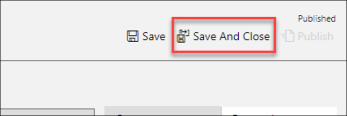

# Power Platform App in a Day

## Module 3 : Power Apps Model-driven App

### Contents
Power Apps Model-driven App</br>
Lab Prerequisites</br>
Exercise 1: Create Application and add Fields to the Device Order Entity</br>
Exercise 2: Business Process Flow</br>
Exercise 3: Form and View Modification</br>
Exercise 4: Test the application</br>
Lab survey</br>
References</br>
Copyright</br>

## Power Apps Model-driven App

### Lab Prerequisites

This is the third lab in a five-part series covering Power Apps, Common Data Service, Power Automate and Power BI. The
assumption is that you have successfully completed the first two modules, or at least the initial part of setting up an
environment as described in the overview – “ **00 - AppInADay Lab Overview** ”.

If you have not completed the previous two modules, you can use the partially completed version of the lab package in
the “\Completed\Module2” folder. Follow the instructions in the document “Importing Module 2 Completed” before
proceeding with this module, which will provision the app, and the Common Data Service entity into your environment.

### Model-driven Apps – A brief introduction

The model-driven apps are built by composing multiple page types and components using several focused designers.
Additionally, there are designers for the entity and business logic. The page types come from the View Designer, Form
Designer, and Dashboard Designer. Visual components include the Sitemap Designer and Business Process Flow Designer.
The App Designer then composes the app by identifying the UI elements to show. The multiple designers allow rich
targeted definition of different parts of the app and its behavior.

- App Designer specifies the sitemap, global dashboards, business processes flows, and entity forms, views, and
    dashboards learn more
- Sitemap Designer provides the application navigation that is always available learn more
- Business Process Designer provides stages and steps to guide users consistently through common business
    processes within a form learn more
- Entity Designer defines the fields, relationships, and metadata for an entity learn more
- Business Rule Designer provides no-low business logic for an entity learn more
- View Designer specifies columns and filter conditions for a record list learn more
- Form Designer specifies the fields and controls along with layout for a single record learn more
- Dashboard Designer summaries one or more entities using charts, lists, etc. learn more

The model-driven apps are fully responsive so a single definition works from web to tablet to mobile devices. This is a
different with the canvas apps which need to choose the mobile vs. Tablet when defining the app.

### Scenario for building a Model-driven app

In the first lab module, you built a Power Apps Canvas application for an organization where every three years the
employees go through a hardware refresh cycle. The application let employees place a request for a device using the


Power Apps app that you built. In the second lab module, using a custom entity you created in the Common Data Service
lab, you stored that request for processing.

From the requesting employee's point of view, after they place the order, the new device just magically shows up. But
there is a back-office process that needs to happen to manage the procurement, setup of the device, and distribution of
the device to that requesting employee. In this lab you will be building a Power Apps Model-driven app that will be used
by the two or three back office staff that manage fulfilling device requests. Using the Model-driven app style, you can take
advantage of the Business Process feature of Model-driven apps to keep the back-office staff on track for each device
request.

   <br/>

Model-driven apps are a new style of application you can build directly from PowerApps.com. Model-driven apps make it
easy to build forms over data applications quickly. This style of application brings together forms, views, dashboards and
charts quickly to provide a productive user experience for working with related data. These components can quickly be
customized to show only the data that is relevant for the scenario.

**Entity views** : Views are what users see when they look at a list of records from the Common Data Service. Views define
the columns that are visible as well as the criteria for inclusion of the records in the display.

**Entity forms** : Forms are used when users drill down into a record from an Entity View. Forms are created using a visual
drag-and-drop designer to place fields into the form that is structured into tabs and sections.

**Business process flows** : These flows are interactive visual guides to help the user through a business process. Business
process flows use the concept of stages that contain steps. Stages are milestones in the process that need to be
completed and the steps highlight to the user either data to collect or tasks to complete the stage to progress. Flows are
created using a visual designer using drag and drop to compose the flow and establish any branching conditions
(different paths in the business process) that must be handled.

For more details on Model-driven apps and the differences between Canvas apps and Model-driven apps, see the product
announcement at Announcement.


### Exercise 1: Create Application and add Fields to the Device Order Entity

In this exercise, you will be creating a standalone Model-driven application that will leverage the same Device Request
entity you created in the Common Data Service in Lab 2.

Task 1: Create an application

The first thing you will do is create a Model-driven application. This application will serve as a container to identify all the
components that make up the application. It also will include a sitemap that defines the custom navigation users will use
to navigate between the components (Entity views, Dashboards and other visual components).

1. Navigate to Make Power Apps, and select the environment you created. </br>
2. Select **Home** and click **Model Driven App from Blank**. </br>

    <br/>
3. Click **Create**.</br>

    <br/>
4. Enter **Device Procurement** for Name and click **Done.** You have now created the app definition and will start
    adding components in to build the app.</br>
    
    <br/>


```
Note : When building a real app, you would also upload an image to be used as the App Tile. The App Tile is seen by
the user in the list of all their applications.
```
```
Next, you will build a Site Map for the application, the completed Site Map will look like the image below.
```
   <br/>

5. Click **Edit Site Map**. This will launch the designer that will let you modify the App navigation.</br>

     <br/>
6. Select the **New Area** label, in the properties rename it **Back Office** and enter **nav_backoffice** for ID**.** If you were
    building a more complex application, you could use Areas to group together related items making it easy for the
    user to navigate between the components.</br>
    
     <br/>
    


```
Note: The properties panel on the right will only show if you click on the New Area on the left.
```
7. Select the **New Group** enter **Orders** for Title, and **nav_ordersgroup** for ID.</br>

     <br/>
    
```
Note: The properties panel on the right will only show if you click on the New Group on the left.
```
8. Select the **New Subarea**.</br>

     <br/>

```
Note: The properties panel on the right will only show if you click on the New Subarea on the left.
```
9. Set the **Entity** for **Type** , select **Device Order** for **Entity** , enter **Device Orders** for **Title** and enter
    **nav_device_orders** for **ID**.</br>
    
     <br/>
   
10. Click **Save and Close.**</br>

     <br/>
   
11. Click **Save** again, this time in the App Designer.</br>
 
    <br/>
   
12. **Publish** the application.</br>

    <br/>
   
13. Click **Save and Close**.</br>

Task 2: Add procurement fields to the Device Orders

In this task, you will add new fields to the Device Order table. The fields you are going to add here are fields that support
the Business Process Flow, which we are going to build in the next exercise. When you use a Business Process, it consists
of Stages which you can think of as major milestones in completing the work. Each Stage has one or more Steps. Steps
help users keep track of what they need to do before advancing to the next Stage. Steps are just fields on the entity. To
make it quicker when we create the Business Process in this task, we are going to first create the fields that we need.

To support our scenario, we are going to add the following fields to the entity:

**Capital Approved** : This field will be used in the flow to capture that the device order has received capital approval.

**Send Survey** : This field will be used in the final stage. Right now the team plans on manually sending a survey to see how
the user’s ordering experience was, and will manually check this once they send it, but they have a desire in a future
update to automate sending a survey in a future release.

1. Navigate to Make Power Apps.</br>
2. Expand **Data** , select **Entities** , search for **Device Order** and click on it.</br>

    <br/>
    
3. Make sure you have the **Fields** tab selected and click **Add Field**.</br>

    <br/>
    
4. Enter **Capital Approved** for **Display Name** , select **Two Options** for **Data Type** and click **Done**. We are using a
    Two Option data type here because when we use it as a Step in the Business Process, we want to be able to simply
    mark it completed. Two Options are essentially a true or false field.</br>
    
     <br/>
     
5. Create 4 more **Two Option** fields and name them **Device Received, Device Configured, Send Survey** , and
    **Device Delivered**.</br>
    
     <br/>
     
6. Add another field, with the name **Supplier Order ID** , select **Text** for **Data Type** and click **Done**. Notice we
    are not asking you to make this field required here, but we will make it a required field in the Business
    Process later in the lab.</br>
    
     <br/>
     
7. Click **Save Entity**.</br>

     <br/>

### Exercise 2: Business Process Flow

In this exercise, we are going to add a Business Process Flow to the Device Order to help guide the back-office worker
through the task of managing the procurement of the requested device.

In discovery meetings with the back-office workers, we learned that a device request goes through the following tasks as
they perform the magic to get the requestor their device.

- **Device Requested** – Today this is an e-mail sent to them with the device request. Going forward in the new
    Power Apps world this will be a Device Order record in the Common Data Service.
- **Place Order** – Once they receive the request, they will place an order with a supplier and get an order ID.
- **Receive Device** – This occurs when the device is received, and they send it to the IT staff to be configured with
    the standard software.
- **Distribute Device** – Once configured it needs to get to the employee that requested it, and they need to survey
    the employee to make sure they are happy.

Each of these represents a milestone and will become our Stages in the Business Process Flow. In a more complex
scenario, you would likely end up compressing or even possibly re-imagining the business process to make it more
optimal than the current process the staff performs with their existing process.

For this lab, the _Receive Device and Distribute Device stages are marked optional_. While these stages would need to be
created for a full implementation of the scenario, to save time you may skip them or do them as a take home exercise.

The completed Business Process Flow will look like the image below.


Task 1: Create business process flow

1. Select **Flows**.
2. Select the **Business Process Flow** tab and click **New**.
3. Enter **Device Procurement Process** for Flow Name, type and then select **Device Order** for Entity, and click
    **Create**. When you create the Business Process Flow behind the scenes it creates another entity with the same
    name as the Business Process Flow to track the progress of each business process on the record. Because of this,
    choose your name carefully, for example, you wouldn’t want to use the same name as your entity e.g. Device
    Order. Here we choose Device Procurement Process. Note: After you click OK, a new window will be loaded with
    the designer. If you have popup blockers enabled this might be blocked. The window might also not immediately
    have focus and you might have to manually bring it into focus.
4. Select the **New Stage** and change the Display Name to **Device Requested** and click **Apply**.
5. Click **Details.**
6. Select the **Data Step** , select **Request Date** for Data Field and click **Apply**. The Step Name will auto-filled for you.
7. Click **Add** and select **Add Data Step**.
8. Click on the small + under Data Step #1.
9. Select **Approval Status** for Data field and click **Apply**.
10. Add another Data Step, select **Price** for Data Field and click **Apply**.
11. Select the **Components** tab.
12. Drag **Stage** to the canvas and place to the right of the **Device Requested** stage.
13. Select the new stage, change the Display Name to **Place Order** and click **Apply**.
14. Click **Details**.
15. Select the existing Data Step, select **Estimated Ship Date** for Data Field, and click **Apply**.
16. Select the **Components** tab, drag **Data Step** to the canvas and place is under the **Estimated Ship Date** step.
17. Select **Supplier Order ID** for Data Field, check the **Required** field to and click **Apply**. Remember from before this
    field isn’t required, but by checking this here, we will require it to be filled out before they can advance to the next
    stage. It won’t, however, block saving the record if there isn’t a data value populated like it would if it was marked
    required on the field definition.
**NOTE: All steps from here onwards until you reach Task 2 are OPTIONAL. These steps add two more stages to the
business process using the same technique you learned above. You may skip ahead to Task 2 to add a branch
condition.**
18. Select the **Components** tab and drag **Stage** to the right side of the **Place Order** stage.
19. Select the new stage, change the Display name to **Receive Device** and click **Apply**.
20. Click **Details**.
21. Select the existing Data Step and select **Device Received** for Data Field and click **Apply**.
22. Select the **Components** tab, drag **Data Step** to the **Receive Device** stage and place it under the **Device Received**
    step.
23. Select **Device Configured** for Data Field and click **Apply**.
24. Add another stage and name it **Distribute Device**.
25. Add two data steps **Device Delivered** and **Send Survey**.

Task 2: Add a branch condition

In this task, we are going to add a conditional branch to our Business Process Flow. When we did the discovery, we
learned that if the price was greater than $1K there were additional steps in place to get capital approval prior to placing
the order. In this task, you will see how we can modify the flow we built to accommodate this.

1. Select the **Components** tab, drag **Condition** and place it between **Device Requested** and **Place Order**.
2. Select the **Condition** and change the Display Name to **Check Price.**
3. In the **Rule 1** section, select **Price** for Field, **is greater than** for Operator, **Value** for Type, **1000** for Value, and click
    **Apply**. It’s important to note that fields you use in the rules on the condition must be in the prior Stages steps.
    That is one of the reasons we put the price in there previously.
4. Click **Save**.
5. A new stage will be added.
6. Select the new stage, change the Display Name to **Capital Approval** and click **Apply**.
7. Click **Details**.
8. Select the existing Data Step, select **Capital Approved** for Data Field and click **Apply**.
9. Click **Save**.
10. Click **Activate**.
11. Confirm the activation.
12. Close the process editor.
13. Select **Solutions**.
14. **Publish All Customizations**.


### Exercise 3: Form and View Modification

In this exercise, we are going to modify the Device Order form to add additional fields. When you create an entity in the
Common Data Service, it also creates a main form for that entity with a few basic fields on it. In addition to the form,
views are created for the entity. Views are used in a Model-Driven app any time a list of the entity records are displayed.
You would modify the view to add additional fields or change the placement. You can also create additional views, for
example, you might provide a view to show all device requests that are waiting to be received.

Task 1: Modify the form

1. Expand **Data** , select **Entities**. Search for **Device Order** entity and click to open.
2. Select the **Forms** tab.
3. Select the **Information Main** form and click **Edit Form** > **Edit form in new tab.**

```
Note: The form designer is being modernized, you can read more here Overview of the model-driven form
designer.
```
4. If you are required to sign in again, do so.
5. Search for **Approver** field and drag it to the form.
6. Place the **Approver** field above the Device Name field.
7. The new form designer will let you reposition fields. Drag the **Approver** field and place it between the Device
    Name and Owner fields.
8. The new form designer will let you cut and paste fields. Select the **Approver** field and click on the **Cut** button.
9. Select the **Owner** field and click **Paste**.
10. The **Approval** field will be moved to the bottom.
11. Click **Save**.
12. Click **Publish**.
13. Close the **Form Designer** tab.

Task 2: Modify the view

1. Select the **Views** tab and click on the **Active Device Orders** view to open it.
2. Click the **Approval Status** field once (you do not need to double click).
3. The new column will be added to the view.
4. Click on the **+ Add Column** button.
5. Select **Estimated Ship Date.**
6. Click + column again and change from **Default** to **All**.
7. Add **Price** and **Status** to the View.
8. Click **Save.**
9. **Publish** the View.
10. Click on the back button.


### Exercise 4: Test the application

In this exercise, we are going to test the application you just built.

Task 1: Test the application

1. Select **Apps** , select the Device Procurement application and click **Play**.
2. The application will start. The **Active Device Orders** view will load.
    **Note: If you don’t show any data in the list, run the Device Ordering canvas app you built and submit some orders.**
3. Start a new web browser instance and navigate to Make Power Apps. Do not close the Model-driven application.
4. Select **Apps** , select the Device Ordering application you created in module 2, and click **Play**.
5. Select two devices, make sure one of the devices is priced over $1,000 and click **Compare**.
6. Select the device with the price over $1k and click **Submit**.
7. Click OK. Note that if you did not choose to create the submission success screen in a previous module that this
    option will not exist. You will need complete steps 3 and 4 (above) in order to continue.
8. Select two more devices and click Compare.
9. Select a device with a price under $1k, provide approver email (or leave in the auto-populated manager email)
    and click **Submit**.
10. Go back to the Model-driven application you created, sort the orders by **Created On** column, and you should see
    the two devices you ordered using the Power Apps Canvas App.
11. Open the one priced over $1k.
12. The **Business Process Flow** will now have **5** stages. This is because this order costs more than $1k and needs
    **Capital Approval**.
13. Click **Device Orders**.
14. Click on the other order you created.
15. The **Business Process Flow** for this order will have **4** stages; this is because this order does not require **Capital**
    **Approval**.


### Lab survey

We would appreciate your feedback on the Business Application Platform technologies and on this hands-on-lab, such as
the quality of documentation and the usefulness of the learning experience.

Please use the survey at **App in a day survey** to share your feedback.

You may provide feedback for each module as you complete it or at the end once you’ve completed all the modules.
Thank you!

### References

App in a Day introduces some of the key functionalities available in Power Apps, Power Automate, Power BI and the
Common Data Service. For an up to date list of learning references, see Power Apps Resources and Power Automate
Resources and Power BI Resources.


## Copyright

© 2020 Microsoft Corporation. All rights reserved.

By using this demo/lab, you agree to the following terms:

The technology/functionality described in this demo/lab is provided by Microsoft Corporation for purposes of obtaining
your feedback and to provide you with a learning experience. You may only use the demo/lab to evaluate such technology
features and functionality and provide feedback to Microsoft. You may not use it for any other purpose. You may not
modify, copy, distribute, transmit, display, perform, reproduce, publish, license, create derivative works from, transfer, or
sell this demo/lab or any portion thereof.

COPYING OR REPRODUCTION OF THE DEMO/LAB (OR ANY PORTION OF IT) TO ANY OTHER SERVER OR
LOCATION FOR FURTHER REPRODUCTION OR REDISTRIBUTION IS EXPRESSLY PROHIBITED.

THIS DEMO/LAB PROVIDES CERTAIN SOFTWARE TECHNOLOGY/PRODUCT FEATURES AND FUNCTIONALITY,
INCLUDING POTENTIAL NEW FEATURES AND CONCEPTS, IN A SIMULATED ENVIRONMENT WITHOUT
COMPLEX SET-UP OR INSTALLATION FOR THE PURPOSE DESCRIBED ABOVE. THE TECHNOLOGY/CONCEPTS
REPRESENTED IN THIS DEMO/LAB MAY NOT REPRESENT FULL FEATURE FUNCTIONALITY AND MAY NOT
WORK THE WAY A FINAL VERSION MAY WORK. WE ALSO MAY NOT RELEASE A FINAL VERSION OF SUCH
FEATURES OR CONCEPTS. YOUR EXPERIENCE WITH USING SUCH FEATURES AND FUNCTIONALITY IN A
PHYSICAL ENVIRONMENT MAY ALSO BE DIFFERENT.

FEEDBACK. If you give feedback about the technology features, functionality and/or concepts described in this demo/lab
to Microsoft, you give to Microsoft, without charge, the right to use, share and commercialize your feedback in any way
and for any purpose. You also give to third parties, without charge, any patent rights needed for their products,
technologies and services to use or interface with any specific parts of a Microsoft software or service that includes the
feedback. You will not give feedback that is subject to a license that requires Microsoft to license its software or
documentation to third parties because we include your feedback in them. These rights survive this agreement.

MICROSOFT CORPORATION HEREBY DISCLAIMS ALL WARRANTIES AND CONDITIONS WITH REGARD TO THE
DEMO/LAB, INCLUDING ALL WARRANTIES AND CONDITIONS OF MERCHANTABILITY, WHETHER EXPRESS,
IMPLIED OR STATUTORY, FITNESS FOR A PARTICULAR PURPOSE, TITLE AND NON-INFRINGEMENT.
MICROSOFT DOES NOT MAKE ANY ASSURANCES OR REPRESENTATIONS WITH REGARD TO THE ACCURACY
OF THE RESULTS, OUTPUT THAT DERIVES FROM USE OF DEMO/ LAB, OR SUITABILITY OF THE INFORMATION
CONTAINED IN THE DEMO/LAB FOR ANY PURPOSE.

DISCLAIMER

This demo/lab contains only a portion of new features and enhancements in Microsoft Power Apps. Some of the features
might change in future releases of the product. In this demo/lab, you will learn about some, but not all, new features.

